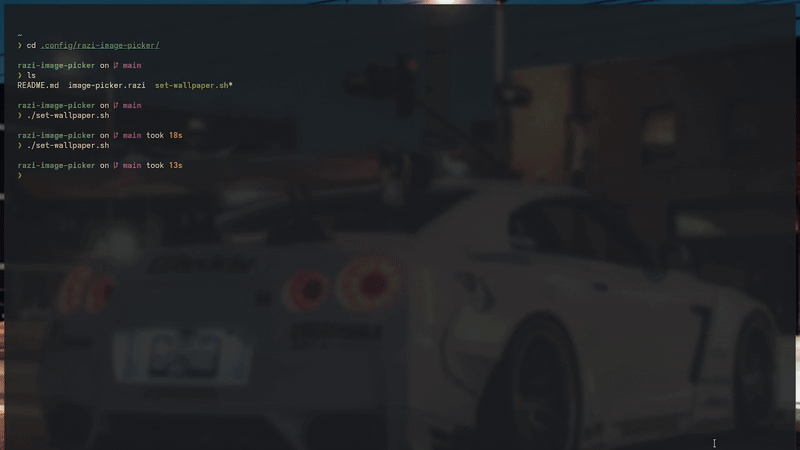

# 🌄 Rofi Wallpaper Picker

A simple and elegant **wallpaper selector** configured using **Rofi**.  

### Preview




### Installation & Usage

```bash
# Clone the repository
git clone https://github.com/SurajKharkwal/rofi-wallpaper-picker ~/.config/rofi-wallpaper-picker

# Make the script executable
chmod +x ~/.config/rofi-wallpaper-picker/set-wallpaper.sh

# Run the wallpaper picker
~/.config/rofi-wallpaper-picker/set-wallpaper.sh
```

If you use a wallpaper manager other than swww, update the final block in set-wallpaper.sh accordingly.
